# 🍔 Food Ordering Website


A responsive **Food Ordering Website** developed using **HTML5, CSS3, Bootstrap 5, and JavaScript**, integrated with an **End-to-End DevOps CI/CD Pipeline** using **GitHub, Jenkins, Docker, and Ansible**.

This project was developed as an **MCA Semester 1 DevOps Mini Project**.

---

# 📌 Project Overview

The Food Ordering Website demonstrates the implementation of modern **DevOps practices** by automating the complete software delivery lifecycle.

The project uses **GitHub** for version control, **Jenkins** for Continuous Integration and Continuous Deployment (CI/CD), **Docker** for application containerization, and **Ansible** for deployment automation. The website is hosted using **Nginx** inside a Docker container.

The application provides users with an interactive interface to browse food items, add them to the cart, and place orders.

---

# ✨ Features

## 👤 User Features

- Responsive Home Page
- Browse Food Menu
- Add Food to Cart
- Shopping Cart
- Place Order
- Contact Us Page
- Mobile-Friendly Interface

---

## ⚙️ DevOps Features

- Git Version Control
- GitHub Repository
- Docker Containerization
- Jenkins CI/CD Pipeline
- Automated Deployment using Ansible
- Nginx Web Server
- Continuous Integration & Deployment
- Automated Build Process

---

# 🛠 Tech Stack

## Frontend

- HTML5
- CSS3
- Bootstrap 5
- JavaScript

## DevOps Tools

- Git
- GitHub
- Docker
- Jenkins
- Ansible
- Nginx
- Docker Desktop
- WSL (Ubuntu)

---

# 🚀 CI/CD Workflow

```
Developer
      │
      ▼
Git
      │
      ▼
GitHub Repository
      │
      ▼
Jenkins Pipeline
      │
      ▼
Docker Image Build
      │
      ▼
Docker Container
      │
      ▼
Ansible Deployment
      │
      ▼
Food Ordering Website
```

---

# 📂 Project Structure

```
food-ordering-website/

│

├── screenshots/

├── Dockerfile

├── Jenkinsfile

├── deploy.yml

├── index.html

├── menu.html

├── cart.html

├── contact.html

├── script.js

├── style.css

└── README.md
```

---

# ⚙️ Installation & Setup

## 1️⃣ Clone Repository

```bash
git clone https://github.com/TanviShevade/food-ordering-website.git
```

---

## 2️⃣ Navigate to Project

```bash
cd food-ordering-website
```

---

## 3️⃣ Open the Website

Open

```
index.html
```

or run using **VS Code Live Server**.

---

# 🐳 Docker Implementation

## Build Docker Image

```bash
docker build -t food-ordering-app .
```

## Run Docker Container

```bash
docker run -d -p 8080:80 food-ordering-app
```

Visit:

```
http://localhost:8080
```

---

# ⚙️ Jenkins CI/CD

The Jenkins pipeline performs:

- Source Code Checkout
- Docker Image Build
- Docker Container Deployment
- Continuous Integration
- Continuous Deployment

Pipeline configuration:

```
Jenkinsfile
```

---

# 🤖 Ansible Deployment

Run:

```bash
ansible-playbook deploy.yml
```

The playbook automates:

- Docker Deployment
- Container Management
- Service Configuration

---

# 📷 Project Screenshots

## 🏠 Home Page

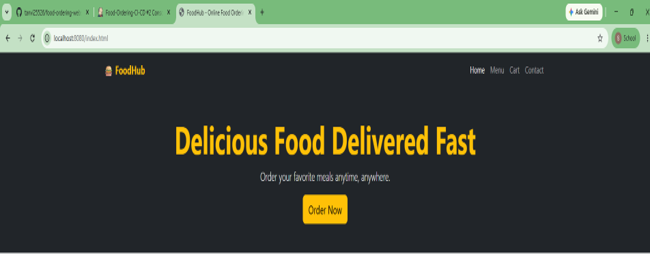

---

## 🍽 Featured Dishes

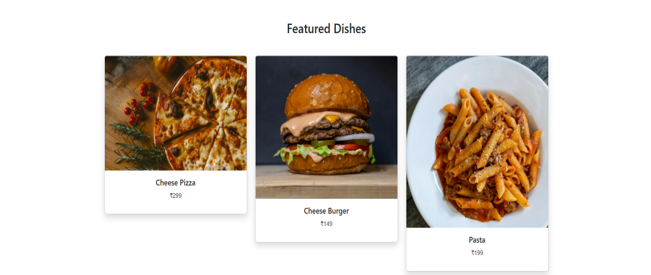

---

## 📋 Menu Page

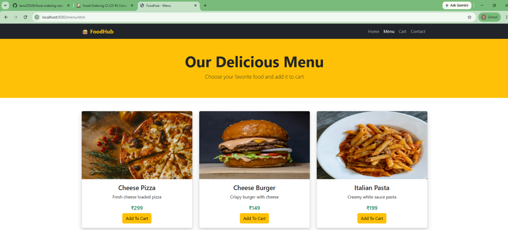

---

## 🛒 Add to Cart

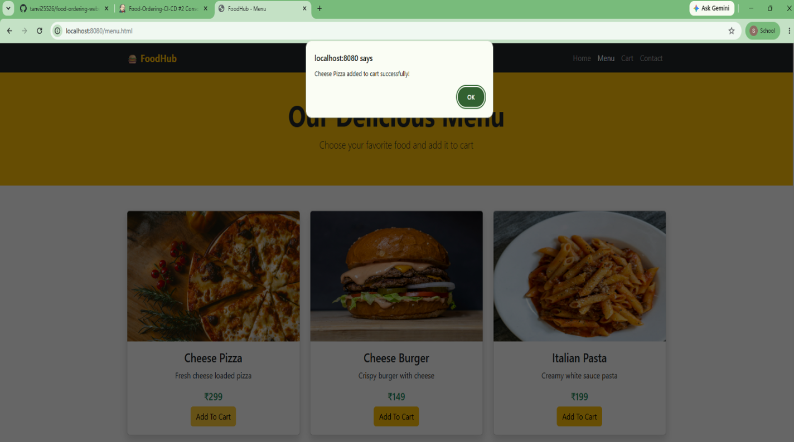

---

## 🛍 Shopping Cart

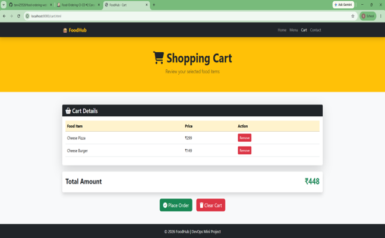

---

## ✅ Order Placed

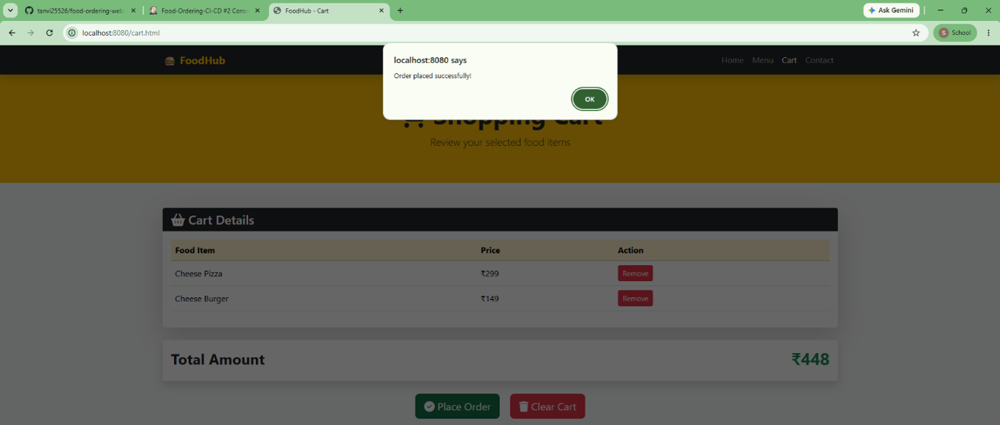

---

## 📞 Contact Us

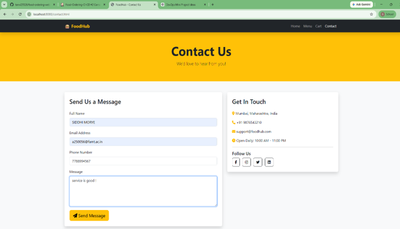

---

# 🐳 Docker Implementation

## Dockerfile

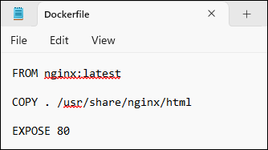

---

## Build Docker Image

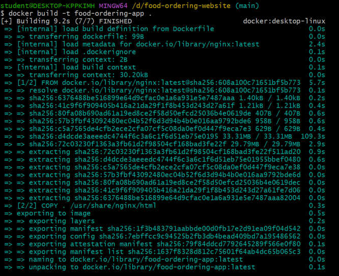

---

## Docker Implementation

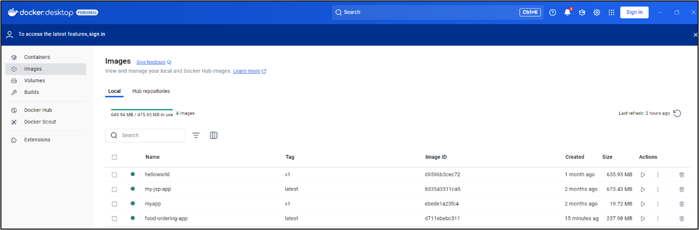

---

## Running Docker Container


---

# ⚙ Jenkins Pipeline

## Jenkinsfile

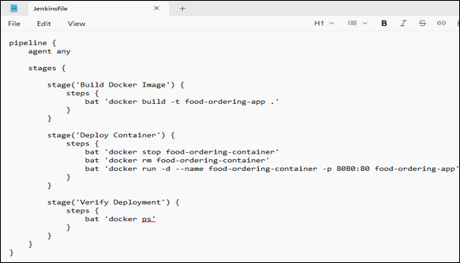

---

## Jenkins Pipeline

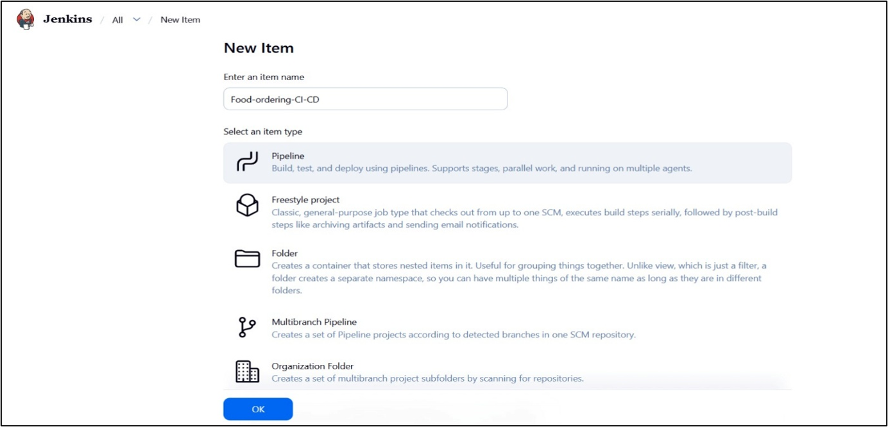

---

## Pipeline Console Output

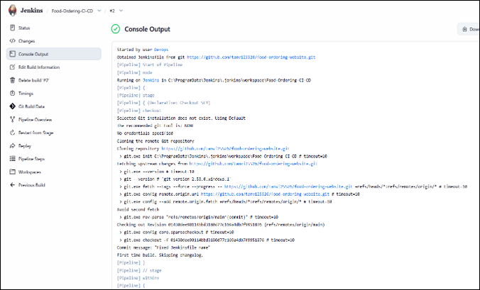

---

## Pipeline Console Output (Success)

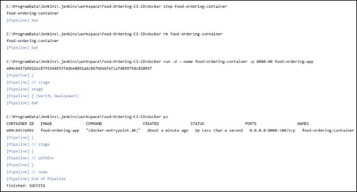

---

# 🤖 Ansible Deployment

## Playbook

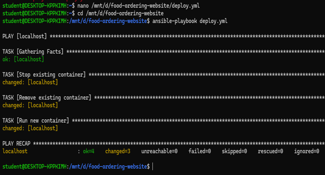

---

## Deployment Configuration

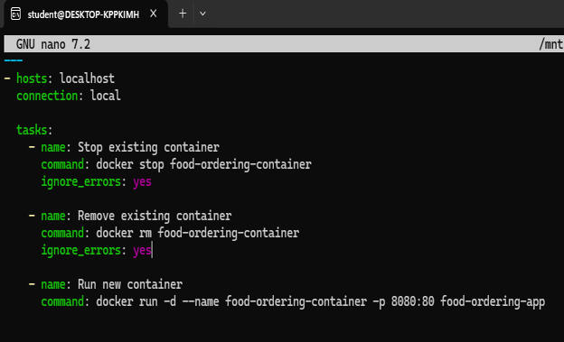

---

# 🎯 Learning Outcomes

- Git Version Control
- GitHub Repository Management
- Docker Image Creation
- Docker Container Deployment
- Jenkins CI/CD Pipeline
- Ansible Automation
- Nginx Configuration
- End-to-End DevOps Workflow

---

# 🚀 Future Enhancements

- User Authentication
- Online Payment Gateway
- Order Tracking
- Database Integration (MySQL)
- Admin Dashboard
- Kubernetes Deployment
- GitHub Actions CI/CD
- AWS Cloud Deployment
- Monitoring using Prometheus & Grafana

---

# 📚 DevOps Architecture

```
Developer

   │

   ▼

Git

   │

   ▼

GitHub Repository

   │

   ▼

Jenkins Pipeline

   │

   ▼

Docker Build

   │

   ▼

Docker Container (Nginx)

   │

   ▼

Ansible Deployment

   │

   ▼

Food Ordering Website
```

---

# 👨‍💻 Author

**Tanvi Shevade**

**MCA Student**

### GitHub

https://github.com/TanviShevade

### LinkedIn

https://www.linkedin.com/in/tanvi-shevade-aabbb6280

---

# 📄 License

This project is developed for **educational purposes** as part of the **MCA Semester 1 DevOps Mini Project**.

---

# ⭐ Support

If you found this project useful, please consider giving this repository a **⭐ Star** on GitHub.
